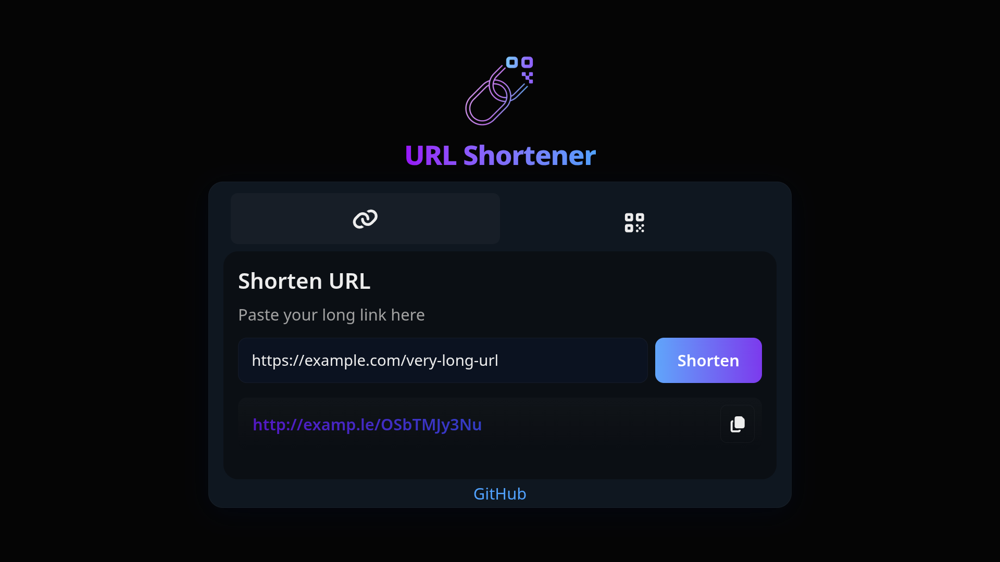

# 🔗 URL Shortener + QR Code Generator

[](https://axios-http.com/)
[](https://cheerio.js.org/)
[](https://www.npmjs.com/package/cors)
[](https://www.npmjs.com/package/dotenv)
[](https://expressjs.com/)
[](https://developer.mozilla.org/en-US/docs/Web/API/Fetch_API)
[](https://fontawesome.com/)
[](https://www.mongodb.com/)
[](https://mongoosejs.com/)
[](https://nextjs.org/)
[](https://nodejs.org/)
[](https://github.com/zpao/qrcode.react)
[](https://react-hot-toast.com/)
[](https://tailwindcss.com/)
[](https://typestrong.org/ts-node/)
[](https://www.typescriptlang.org/)

A free, open-source, no-login URL shortener with QR code generation. Built with **Next.js + TypeScript** on the frontend, **Express + TypeScript** on the backend, and **MongoDB** for data storage.

## 🚀 Features

- 🔒 No authentication required
- 🧠 Avoids duplicate entries: already-shortened URLs are reused
- 🔁 Prevents shortening an already-shortened URL (loop protection)
- ⚙️ Domain can be changed easily via `.env` (no code changes needed)
- 🖼️ Extracts Open Graph metadata from original URL
- 📦 Fully open-source and ready for deployment

## 📦 Getting Started

### 1. Clone the repository

```bash
git clone https://github.com/matheusleiner/url-shortener.git
cd url-shortener
````

### 2. Install dependencies

```bash
# Install frontend and backend dependencies
cd frontend && npm install
cd ../backend && npm install
```

### 3. Set up environment variables

Create a `.env` file in both `frontend/` and `backend/` folders:

#### Example `.env` (backend)

```env
PORT=3001
MONGODB_URI=your_mongodb_connection_string
FRONTEND_URL=https://yourdomain.com
```

#### Example `.env` (frontend)

```env
NEXT_PUBLIC_API_URL=https://api.yourdomain.com
```

### 4. Run the project

```bash
# In two terminals:
cd backend && npm run dev
cd frontend && npm run dev
```

## 🧑‍💻 Contributing

Pull requests are welcome! Feel free to open issues or suggest features.

## 📄 License

This project is licensed under the MIT License.
